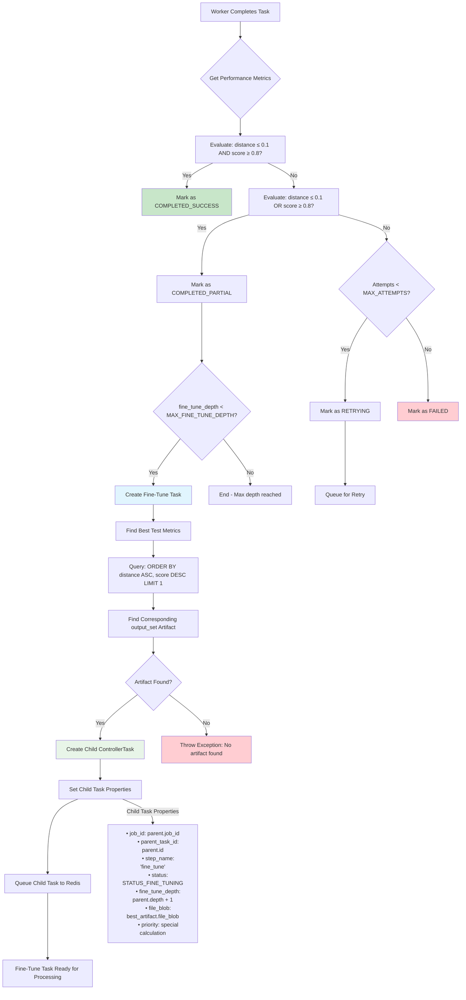
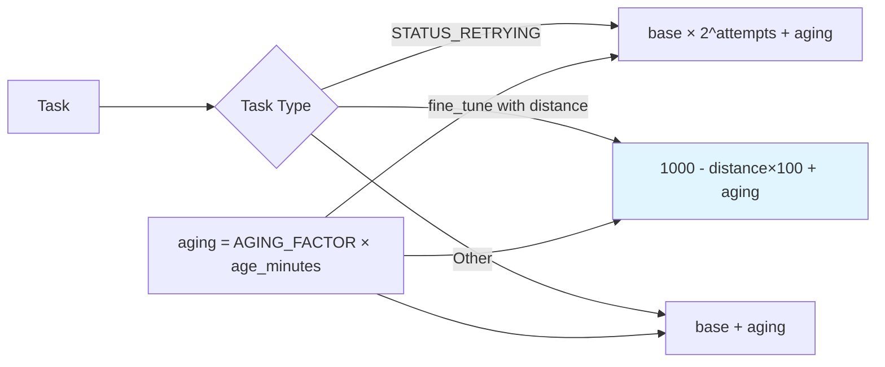
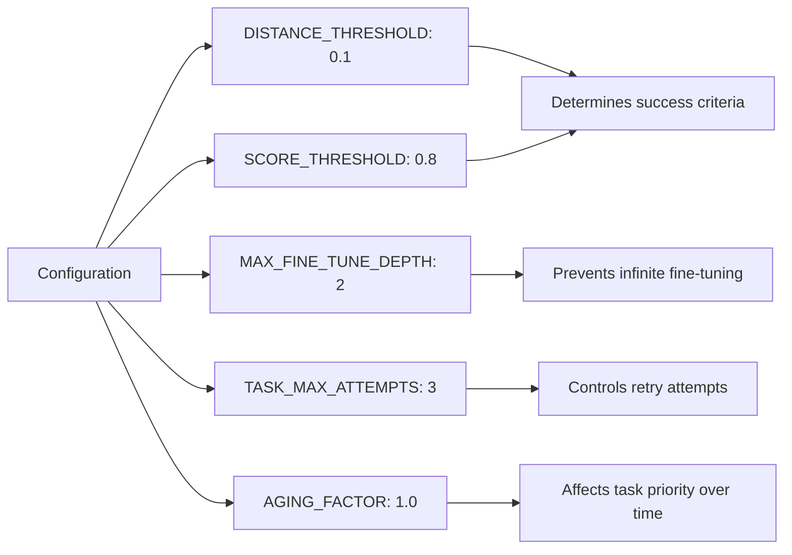

```mermaid
flowchart TD
    A[Worker Completes Task] --> B{Get Performance Metrics}
    B --> C[Evaluate: distance ≤ 0.1 AND score ≥ 0.8?]
    
    C -->|Yes| D[Mark as COMPLETED_SUCCESS]
    C -->|No| E[Evaluate: distance ≤ 0.1 OR score ≥ 0.8?]
    
    E -->|Yes| F[Mark as COMPLETED_PARTIAL]
    E -->|No| G{Attempts < MAX_ATTEMPTS?}
    
    F --> H{fine_tune_depth < MAX_FINE_TUNE_DEPTH?}
    H -->|Yes| I[Create Fine-Tune Task]
    H -->|No| J[End - Max depth reached]
    
    G -->|Yes| K[Mark as RETRYING]
    G -->|No| L[Mark as FAILED]
    
    I --> M[Find Best Test Metrics]
    M --> N[Query: ORDER BY distance ASC, score DESC LIMIT 1]
    N --> O[Find Corresponding output_set Artifact]
    O --> P{Artifact Found?}
    
    P -->|Yes| Q[Create Child ControllerTask]
    P -->|No| R[Throw Exception: No artifact found]
    
    Q --> S[Set Child Task Properties]
    S --> T[Queue Child Task to Redis]
    
    S --> |Child Task Properties| U[
        • job_id: parent.job_id
        • parent_task_id: parent.id
        • step_name: 'fine_tune'
        • status: STATUS_FINE_TUNING
        • fine_tune_depth: parent.depth + 1
        • file_blob: best_artifact.file_blob
        • priority: special calculation
    ]
    
    T --> V[Fine-Tune Task Ready for Processing]
    
    K --> W[Queue for Retry]
    
    style I fill:#e1f5fe
    style Q fill:#e8f5e8
    style D fill:#c8e6c9
    style L fill:#ffcdd2
    style R fill:#ffcdd2
```

## Priority Calculation for Fine-Tune Tasks

```mermaid
flowchart LR
    A[Task] --> B{Task Type}
    B -->|STATUS_RETRYING| C[base × 2^attempts + aging]
    B -->|fine_tune with distance| D[1000 - distance×100 + aging]
    B -->|Other| E[base + aging]
    
    F[aging = AGING_FACTOR × age_minutes] --> C
    F --> D  
    F --> E
    
    style D fill:#e1f5fe
```

## Configuration Impact

```mermaid
graph LR
    A[Configuration] --> B[DISTANCE_THRESHOLD: 0.1]
    A --> C[SCORE_THRESHOLD: 0.8] 
    A --> D[MAX_FINE_TUNE_DEPTH: 2]
    A --> E[TASK_MAX_ATTEMPTS: 3]
    A --> F[AGING_FACTOR: 1.0]
    
    B --> G[Determines success criteria]
    C --> G
    D --> H[Prevents infinite fine-tuning]
    E --> I[Controls retry attempts]
    F --> J[Affects task priority over time]
```